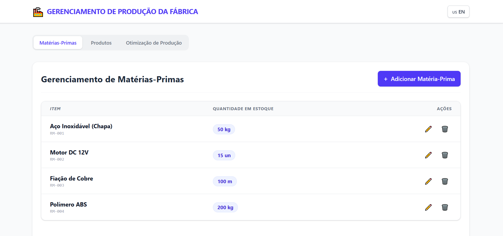
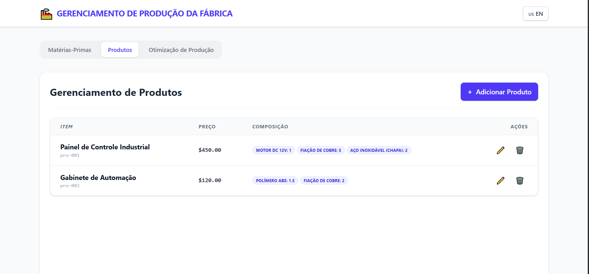
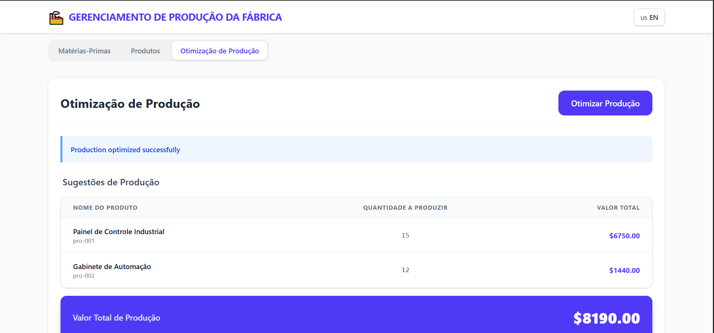

# 🏭 Factory Production Management System

A comprehensive system for managing industrial production, optimizing the production of items based on available raw materials to maximize profit.

## 🚀 Tech Stack
<div align="center">
 
 
 
 
 
 
 
 
 
 
 
 
 
 
 
</div>

## 🎯 Features

- **Raw Materials Management**: Create, read, update, and delete raw materials with stock tracking
- **Products Management**: Create, read, update, and delete products with composition configuration
- **Production Optimization**: Algorithm that analyzes current inventory and suggests which products to manufacture for maximum profitability
- **Internationalization**: Support for English and Portuguese
- **Unit Tests**: Comprehensive test coverage for backend and frontend
- **RESTful API**: Clean and well-documented API endpoints
- **API Documentation**: Interactive API documentation with Swagger UI
- **Responsive UI**: Tailwind CSS-based modern and utility-first interface

## Demo

### Raw material screen
<div align="center">
  
</div>

### Products screen
<div align="center">
  
</div>

### Optimization screen
<div align="center">
  
</div>

## 🛠️ Technologies

### Backend

- **Java 21**
- **Spring Boot 4.0.3**
- **Spring Data JPA**
- **PostgreSQL**
- **Maven**
- **JUnit 5 + Mockito** (Testing)

### Frontend

- **Vue.js 3**
- **Vite**
- **Tailwind CSS**
- **Axios**
- **Vue I18n** (Internationalization)
- **Vitest** (Testing)

## 📋 Prerequisites

- Java 21 or higher
- Maven 3.6+
- Node.js 16+ and npm
- Docker and Docker Compose
- PostgreSQL (or use Docker)

## 🚀 Getting Started

### 1. Clone the Repository

```bash
git clone <repository-url>
cd factory-project
```

### 2. Start the Database

```bash
docker-compose up -d
```

This will start a PostgreSQL database on `localhost:5432`

- **Database**: factory_db
- **Username**: user
- **Password**: password

### 3. Setup Backend

```bash
cd backend/api
mvn clean install
mvn spring-boot:run
```

The API will be available at `http://localhost:8080`

## 📖 API Documentation (Swagger)

The API documentation is available via Swagger UI after starting the backend:

🔗 http://localhost:8080/swagger-ui/index.html

Swagger provides:

- Interactive endpoint testing
- Request/response schema visualization
- Automatic documentation of REST controllers
- Try-it-out feature for real-time API execution

### 4. Setup Frontend

Open a new terminal window/tab:

```bash
cd frontend
npm install
npm run dev
```

The frontend will be available at `http://localhost:3000`
 
## 📚 API Endpoints

### Raw Materials

- `GET /api/raw-materials` - List all raw materials
- `GET /api/raw-materials/{id}` - Get a specific raw material
- `POST /api/raw-materials` - Create a new raw material
- `PUT /api/raw-materials/{id}` - Update a raw material
- `DELETE /api/raw-materials/{id}` - Delete a raw material

### Products

- `GET /api/products` - List all products
- `GET /api/products/{id}` - Get a specific product
- `POST /api/products` - Create a new product
- `PUT /api/products/{id}` - Update a product
- `DELETE /api/products/{id}` - Delete a product

### Production Optimization

- `GET /api/production/optimize` - Get production suggestions for maximum profit

## 💾 Data Models

### Raw Material (Insumo)

```json
{
  "id": 1,
  "code": "FLOUR",
  "name": "Flour",
  "stockQuantity": 1000,
  "unit": "g",
  "description": "Wheat flour"
}
```

### Product

```json
{
  "id": 1,
  "code": "BREAD",
  "name": "Bread",
  "price": 10.0,
  "description": "White bread",
  "composition": [
    {
      "id": 1,
      "rawMaterialId": 1,
      "rawMaterialName": "Flour",
      "quantityRequired": 200
    }
  ]
}
```

### Production Suggestion

```json
{
  "suggestions": [
    {
      "productId": 1,
      "productCode": "BREAD",
      "productName": "Bread",
      "price": 10.0,
      "quantityToProce": 5,
      "totalValue": 50.0
    }
  ],
  "totalValue": 50.0,
  "message": "Production optimized successfully"
}
```

## 🧪 Running Tests

### Backend Tests

```bash
cd backend/api
mvn test
```

### Frontend Tests

```bash
cd frontend
npm run test
```

### Frontend Test UI

```bash
cd frontend
npm run test:ui
```

## 🌐 Internationalization

The application supports multiple languages:

- **English (en)** - Default
- **Portuguese (pt)**

To change language, click the language toggle button on the top-right of the application.

## 🧮 Production Optimization Algorithm

The algorithm uses a greedy approach to maximize production value:

1. **Calculate Capacity**: For each product, calculate the maximum units that can be produced with current stock
2. **Sort by Value**: Sort products by total production value (unit price × max units) in descending order
3. **Greedy Selection**: Select products in order of profitability, consuming raw materials as needed
4. **Conflict Resolution**: When multiple products require the same raw material, priority is given to higher-value products

## 📊 Project Structure

```
factory-project/
├── backend/
│   └── api/
│       ├── src/
│       │   ├── main/
│       │   │   ├── java/com/factory/api/
│       │   │   │   ├── model/
│       │   │   │   ├── dto/
│       │   │   │   ├── service/
│       │   │   │   ├── controller/
│       │   │   │   ├── repository/
│       │   │   │   └── ApiApplication.java
│       │   │   └── resources/
│       │   │       └── application.properties
│       │   └── test/
│       │       └── java/com/factory/api/service/
│       └── pom.xml
├── frontend/
│   ├── src/
│   │   ├── components/
│   │   ├── services/
│   │   ├── locales/
│   │   ├── App.vue
│   │   └── main.js
│   ├── index.html
│   ├── vite.config.js
│   └── package.json
├── docker-compose.yml
├── .gitignore
└── README.md
```

## 🔧 Configuration

### Database Configuration (backend/api/src/main/resources/application.properties)

```properties
spring.datasource.url=jdbc:postgresql://localhost:5432/factory_db
spring.datasource.username=user
spring.datasource.password=password
```

### CORS Configuration

CORS is enabled for all origins (`*`) in the controllers. You can restrict this in production:

```java
@CrossOrigin(origins = "http://localhost:3000")
```

## 📝 Development Notes

### Code Quality

- Code follows Clean Code principles
- All code comments are in English
- Variable and method names are descriptive
- Classes and methods have single responsibility

### Error Handling

- RESTful HTTP status codes (200, 201, 204, 400, 404, 500)
- Meaningful error messages
- Input validation on both frontend and backend

### Performance

- Lazy loading of relationships in JPA
- Query optimization
- Frontend bundle optimization with Vite

## 🚢 Deployment

### Backend (Docker)

```dockerfile
FROM openjdk:21-jdk
COPY backend/api/target/*.jar app.jar
ENTRYPOINT ["java","-jar","/app.jar"]
```

### Frontend (Docker)

```dockerfile
FROM node:18 as build
WORKDIR /app
COPY frontend/package*.json ./
RUN npm install
COPY frontend . .
RUN npm run build

FROM nginx:latest
COPY --from=build /app/dist /usr/share/nginx/html
```

## 📄 License

This project is MIT licensed.

## 👤 Author

[@Carlos Alexandre](https://github.com/alexandrecarloss)

## 🤝 Contributing

Contributions are welcome! Please feel free to submit a Pull Request.

## 📞 Support

For support, open an issue on GitHub.

---
